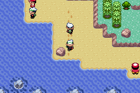
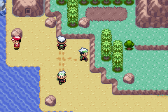
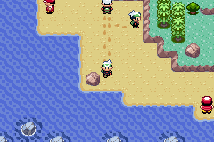
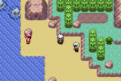
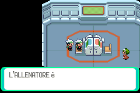
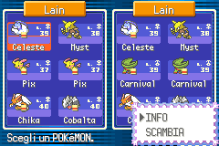

# gen3-poke-multiplayer

> 🇮🇹 Versione italiana: [README.it.md](README.it.md)

**Watch your friends walk around your Pokémon Emerald. On a real Game Boy Advance, with the original cartridge, over the internet.**

No modified ROM, no save file touched, no in-game tricks:
plug in the cable, switch on, play — and the other players show up on your map and walk
around it with the game's real animation.

🌐 **Try it now from your browser:** https://gbcatrade.wired-ariel.it/gen3-poke-multiplayer/
📦 **Ready-made binaries (firmware, multiboot stub, mGBA script):** this repository's *Releases* page

| Player 1 | Player 2 | Player 3 |
|---|---|---|
|  |  |  |

*The same scene seen from three different games: everyone sees the other two.*

| Walking together | Cable Club over the internet | Trade completed |
|---|---|---|
|  |  |  |

> ⚠️ **Which versions work:** on a **real GBA**, the **Italian** Pokémon Emerald cartridge only, for now.
> In the **emulator (mGBA)**, both the **Italian** and the **English (USA/Europe)** ROM — and they play
> together. The in-game screenshots are in Italian because that's what we play. Most of the source code comments are in Italian too.
>
> ⚠️ **Use at your own risk.** The program never writes your save file, but it runs code inside the game on
> your original cartridge, and it comes with **no warranty** (GPL-3.0). If you can, **back up your save first**
> (with a cartridge dumper or flash cart; in mGBA just copy the `.sav` file).

---

## Contents

1. [What it does (and doesn't)](#what-it-does-and-doesnt)
2. [What you need](#what-you-need)
3. [How to play — three ways](#how-to-play--three-ways)
4. [How it really works](#how-it-really-works)
5. [Repository layout](#repository-layout)
6. [Building from source](#building-from-source)
7. [Tests](#tests)
8. [Hosting your own relay](#hosting-your-own-relay)
9. [Known limitations](#known-limitations)
10. [Credits and sources](#credits-and-sources)
11. [Legal](#legal)

---

## What it does (and doesn't)

**It does:**
- show **up to 3 friends** (4 players in total) walking, running, cycling and surfing on your
  map, with animation, footsteps and interpolation **from the original engine**;
- follow map changes: when a friend crosses a route border you see them arrive,
  when they enter a house they disappear and reappear when they come out;
- go to sleep by itself in battles, menus and special screens, and wake up when you
  return to the overworld;
- **trades and battles over the internet** through the game's Cable Club (tested on real
  hardware, from the website and from the PC panel);
- let real GBAs, mGBA emulators and browser spectators play together **in the same room**;
- provide a **Live map** of Hoenn showing where everyone is.

**It doesn't:**
- modify the cartridge (it's mask ROM: physically impossible), and it **never writes the
  save file**;
- distribute the game or any part of it: **you need your own cartridge** (or your own dump, for the emulator);
- require any in-game action: no glitches, no PC boxes, no button
  sequences.

---

## What you need

### To play on a real GBA
- a **Game Boy Advance** (or GBA SP) and an original **Italian Pokémon Emerald** cartridge;
- a **Raspberry Pi Pico (RP2040)** with a link board (e.g.
  [game-boy-pico-link-board](https://github.com/agtbaskara/game-boy-pico-link-board)) and a
  5-pin **GBA link cable**;
- the **Celio firmware extended by this project** (`celio.uf2` in the Releases — flashed only
  once: hold BOOTSEL, plug in the Pico, drag the file onto the `RPI-RP2` drive);
- **Chrome or Edge** (WebUSB is required). On **Windows**, once: the **WinUSB** driver for the
  Pico via [Zadig](https://zadig.akeo.ie/).

### To play on an emulator
- **mGBA 0.10 or later** (with Lua scripting) and **your own** dump of Pokémon Emerald, **English (USA/Europe)
  or Italian**;
- the mGBA script matching your ROM (download it from the website, already set up with your room, or grab
  from the Releases `gen3-poke-multiplayer-emulatore-usa.lua` for the English ROM or
  `gen3-poke-multiplayer-emulatore.lua` for the Italian one).

### To just watch
- any browser, Firefox included: **spectator** mode + Live map.

---

## How to play — three ways

All three end up **in the same room**: pick a number between 1 and 65535 and everybody uses it.

### A. Real GBA, from the browser (recommended)
1. Open the website, press **«Connect the Pico»** and pick the device.
2. Switch on the GBA **with no cartridge**, cable plugged in. Press **«Load the game into the GBA»**:
   the screen turns **red** (~15 s, the program travels through the cable).
3. When the site tells you, **insert the cartridge with the console on**: **yellow** screen, then
   **green**, and Emerald boots normally — with our program already inside.
4. Load your save, type the **room** and press **«Play»**. Done.

### B. Real GBA, from the PC panel
```bash
pip install pyusb libusb-package
```
```bash
net\PANNELLO.bat
```
It opens `http://127.0.0.1:7411` (Italian UI): same steps as the website (relay, multiboot, game,
unlock), plus the full logs. By default the panel **hosts a relay on your own PC** (role «ospite»):
to join the public relay instead, in the settings choose role **«amico»** and set the relay to
`wss://gbcatrade.wired-ariel.it/gen3-poke-multiplayer/ws`. Command-line fallback: `net\1-multiboot.bat` then `net\2-gioca-internet.bat`.

### C. mGBA emulator
1. On the website, type the room, pick your ROM (**English** or **Italian** Emerald) and press
   **«Download the emulator script»**.
2. In mGBA load your Emerald ROM, get into the overworld, then *Tools → Scripting → File →
   Load script* → the downloaded script (`gen3-poke-multiplayer-roomN-eng.lua` or `-ita.lua`).
3. Room and peer can also be changed in game: **L+R+B** opens a small panel (open it while standing still).

---

## How it really works

### The constraint that rules everything
The link cable can't add features to a game: it can only speak the protocol the ROM already
knows. And in Gen 3 **there is no routine** that draws a remote player on a route.
So, to get a shared overworld, **our own code has to run inside the game**.
Emerald's code runs from ROM (not writable), but the game is steered through
**pointers in RAM** — and those can be rewritten.

### The entry vector: *resident* multiboot
The GBA BIOS only enters multiboot mode **with an empty slot**. The trick is to exploit the order
of events:

1. empty slot → the PC/browser loads a **stub** (`hw/mbstub`) over the cable in 16-bit MultiPlay mode
   (the same mode as the Cable Club, so **same cable and same firmware** as in game);
2. the stub copies the **payload** to the top of EWRAM (`0x0203CF80`, a corner Emerald never uses)
   and waits for the cartridge;
3. once the cartridge is inserted, the stub jumps into `AgbMain` **after** memory is cleared
   (`0x080003CE`, after `InitIntrHandlers`): in retail Emerald `crt0` clears nothing, so
   the payload survives;
4. the payload hooks the **IRQ vector at `0x03007FFC`** and chains the original handler: from then on
   it runs every frame, forever, whatever scene the game loads.

Nothing is left at power-off: it all lives in RAM.

### The decisions that matter
1. **Movement actions, not coordinates.** We never write x/y to the remote character (it would teleport
   tile by tile): we queue `MOVEMENT_ACTION_WALK_NORMAL_DOWN` & co. The engine gives us
   animation, sub-pixel movement and timing for free. It's indistinguishable from a real NPC.
2. **Events, not state.** We don't send the position every frame: we send «I started a step,
   direction D, from tile T» (**12 bytes**), plus an absolute position now and then as a correction.
   100 ms of ping = your friend half a step behind, invisible.
3. **Hook the IRQ, not the scene callback.** `gMain.vblankCallback` is rewritten at every scene
   change; the IRQ vector isn't.
4. **A map change is a protocol event.** Crossing a route border isn't a warp, and
   the game updates map and coordinates at two different moments: on a map change we realign and
   send an absolute position, never a «step» (a step is one tile, by definition).
5. **The IRQ never touches the game.** The IRQ only does serial I/O; everything that creates or moves objects
   runs from the main loop (`gMain.callback1`), where the game expects it.
6. **Redundancy against loss.** The USB→SIO hop drops a few frames and nothing stitches them back: every
   STEP/TURN goes out twice towards the game and the payload discards the copy by sequence number.

### Nothing to reimplement: the decomps
[pokeemerald](https://github.com/pret/pokeemerald) is a **matching** decompilation: the build's `.map`
gives the address of every function. The payload calls the original routines directly to create,
move and animate object events, and reuses sprites already in ROM.
The addresses for the **Italian** ROM were found by signature (`tools/port_syms.py`, 42/42).

### The chain
```
GBA ─link cable─ Pico (Celio F-1…F-4) ─USB─ browser (WebUSB) or client.py
    ─WebSocket 443 / UDP─ relay ─ … ─ and back, all the way to your friend's GBA
```
- **The relay understands nothing**: it manages rooms and delivers datagrams. A «room» is the game, not the map.
- **Only `net/client.py` and `web/js/bridge.js` know the 12-byte format** (sender slot
  in the high nibble of the type): dedup, reordering, gap stitching, ×2 copies.
- **The payload talks through a mailbox** in RAM: in the emulator the mailbox is read by mGBA's Lua, on
  hardware by the SIO driver (`payload/sio.c`) in 16-bit Multi-Player mode.

### The Pico firmware
Celio extended with a **passthrough** mode (`0x04`) and four changes (patch in `hw/firmware/`):
**F-1** exchange timing configurable at runtime, **F-2** no filtering of `0x0000` words
(plus back-pressure on `sendData`), **F-3** `SetCableType`, **F-4** software reboot
(`0x43 0xA5`) used at the end of multiboot. Measured exchange period: ~4 ms → **226 words/s**.

### Space: ~11 KB, counted to the byte
The payload lives in ~11.5 KB of EWRAM, IRQ stack included. To fit 4 players and the serial
driver: `-Os` on `main.c`, GCC flags chosen by a **bidirectional greedy search** re-run after
every significant change, `noinline` helpers to pay for Thumb-1 literal pools only once, and
guards in `build.ps1` that **fail the build** if the margin, the static IRQ stack or the
C↔Lua contract (`PayloadState` ↔ table `S`) don't add up.

---

## Repository layout

| Folder | What |
|---|---|
| `payload/` | the code that runs **inside** Emerald: IRQ hook (`hook.S`), logic (`main.c`), SIO driver (`sio.c`), ROM symbols (`game_syms*.h`, generated) |
| `hw/mbstub/` | the multiboot stub that loads the payload and jumps into the cartridge |
| `hw/firmware/` | Celio firmware patch (F-1…F-4) and instructions to rebuild it |
| `hw/gbalink-fw/` | alternative link firmware for RP2040 (GPL-3.0) |
| `hw/siotest/` | SIO test bench on hardware (uses the same `sio.c` as the payload) |
| `mgba/` | emulator side: `inject_body.lua` (injector + networking), `club_lua.lua`, WebSocket library, autopilot for automated tests |
| `net/` | PC side: `client.py`, `relay.py`, `relay_ws.py`, `mb_multi.py` (multiboot), `usb_link.py`, `club_link.py` (Cable Club over the internet), `pannello.py` + `pannello.html`, `mappa.html`, tests |
| `web/` | the website: in-browser panel (WebUSB + multiboot + WebSocket relay + Cable Club), explanations in IT/EN, test pages |
| `tools/` | generators (symbols, map, Italian names from the ROM), package and site builders, simulator, tests |
| `build.ps1` | the build of the payload and the Lua scripts, with all the guards |

---

## Building from source

Tools: **Windows + PowerShell 5.1**, [Arm GNU Toolchain](https://developer.arm.com/downloads/-/arm-gnu-toolchain-downloads)
(`arm-none-eabi-gcc` on PATH), **Python 3.11+**. To regenerate the symbols or the Live map you also
need a build of [pokeemerald](https://github.com/pret/pokeemerald) (devkitARM, in WSL:
`tools/build-pokeemerald.sh`).

```powershell
.\build.ps1 -Syms it -WithSio          # payload for real GBA (Italian ROM + SIO driver)
.\hw\mbstub\build.ps1                  # multiboot stub: embeds the payload JUST built
.\build.ps1 -LinkRole relay -Syms it -OutName emulatore   # mGBA script, Italian ROM
.\build.ps1 -LinkRole relay -Syms usa -OutName emulatore-usa   # mGBA script, English (USA/Europe) ROM
python tools\gen_mappa.py              # Live map data (from the decomp + Italian names from the ROM)
.\tools\prepara-sito-web.ps1 -Relay wss://your.host/ws -Stanza 0     # assembles the website
```

Order matters: the stub embeds the latest `payload.bin`. Every build prints the **EWRAM margin**,
the static IRQ **stack** and the C↔Lua **contract**: if any of the three doesn't add up, the build stops.
The multiboot stub build needs a GBA ROM of your own to copy the header logo from (`-LogoFrom`).

Generated files (`mgba/inject.*.lua`, `payload/game_syms*.h`, `mbstub.gba`) **must not be edited by hand**.

---

## Tests

Standard-library-only unit tests, run one at a time:

```bash
python net/test_tre_giocatori.py
```

The others: `net/test_deframer.py`, `test_bridge_tcp.py`, `test_relay_rebind.py`, `test_club.py`,
`test_pannello.py`, `test_relay_ws.py`, `test_slot.py`, `test_relay_cap.py`, `test_client_ws.py`,
`test_spettatore.py`, `test_presenza.py`, and in `tools/` `test_ruolo_relay.py`, `test_club_lua.py`
(these need `pip install lupa`). The website has its own in-browser self-tests: `web/test.html`,
`web/mb_test.html`, `web/bridge_test.html`.

Hands-free end-to-end test in the emulator: `.\tools\prova-in-tre.ps1 -Rom <emerald-ita.gba> -Giocatori 3`
launches three mGBA instances driven by `mgba/autopilota.lua`, makes them walk and **screenshots** every
screen next to the payload's counters.

---

## Hosting your own relay

The relay is pure Python (`net/relay.py`, UDP) plus a WebSocket front end (`net/relay_ws.py`) for
browsers. Full guide for a VPS with nginx/Caddy and HTTPS: [`net/RELAY-VPS.md`](net/RELAY-VPS.md);
ready-made nginx block: [`net/nginx-passotile.conf`](net/nginx-passotile.conf).

```bash
python net/relay.py --port 9000
```
```bash
python net/relay_ws.py --port 9001 --relay 127.0.0.1:9000
```

At most 4 players per room (the fifth is refused); spectators don't count.

---

## Known limitations

- **Real GBA: Italian cartridge only**, for now: the multiboot stub only accepts the Italian game
  (with an English cartridge it just stays on the red screen). In the **emulator**, the Italian and the
  English (USA/Europe) ROM both work and play together (tested on the public relay, 2026-09-24).
  An English-cartridge stub is the next step: the addresses are known (the decomp *is* the English ROM),
  but nobody on the team has an English cartridge to test it on hardware yet.
  FireRed/LeafGreen are the natural next step (`pokefirered` is decompiled too).
- **16 object events per map**: a crowded map fits 2-3 friends. From the fourth friend on
  there's no avatar, but they stay on the Live map.
- **Non-adjacent maps**: your friend is visible on your map and on the strip of the connected map
  the game keeps loaded (~7 tiles). Beyond that, there's no terrain to draw.
- **Your friend blocks trainers' line of sight**: in the game, line of sight *is* a collision. A deliberate
  choice; you can walk through them with the d-pad, so they never block you in doorways.
- **Firefox and Safari** have no WebUSB: from there you can only watch (spectator).
- **The emulator can't enter the Cable Club** (mGBA can't act as a link partner from a script). Trades and
  battles work between real GBAs.
- Latency: below ~50 ms of ping it's perfect; above that you see a bit of catching up.

---

## Credits and sources

### Who wrote the code
**The main source of this project is [Claude](https://www.anthropic.com/claude), by Anthropic.**
Payload in C/Thumb and assembly, multiboot stub, Pico firmware extensions, SIO driver, network
protocol, client, relay, WebSocket front end, JavaScript ports of the multiboot and the Cable Club,
panels, Live map, ROM analysis tools and tests: all the software in this repository was
written by **Claude (Claude Code)**, over dozens of work sessions guided by Lain.

**Lain** had the idea, provided the hardware, set the constraints («no in-game rituals, ever»,
«Italian cartridge», «the ROM is never touched») and did **all the field testing** — with
**[Hacke](https://github.com/SickPick97)** on the other side of the relay, the first friend to try it over the internet.
The working method was: code → Lain tests on hardware → measure → fix, with every change
shipped together with a test procedure and a counter that has to go up.

### What it builds on
- **[pret](https://github.com/pret)** — the matching decompilations `pokeemerald` and `pokefirered`:
  the address map without which none of this would have been possible. The Live map data comes from there too.
- **Celio project** — the RP2040 firmware for the USB-GBA adapter, the base of the whole hardware layer.
- **smashstacking** — the GBA-USB adapter project Celio is tuned for.
- **agtbaskara** — [game-boy-pico-link-board](https://github.com/agtbaskara/game-boy-pico-link-board).
- **weimanc** — game-boy-zero-link-board.
- **endrift and the [mGBA](https://mgba.io/) project** — emulator, debugger and Lua scripting used throughout development.
- **Martin Korth** — [GBATEK](https://problemkaputt.de/gbatek.htm), the GBA documentation (SIO, multiboot, timing).
- **Raspberry Pi**, **Zephyr RTOS**, **devkitPro**, **Arm GNU Toolchain**.
- **The Celio-Link community on GBAtemp**, the first to crack the toughest hardware layer.
- **Pokémon Showdown** and **Pokémon Database** — the animated Black/White 2 sprites on the Live map (downloaded separately by `tools/sprite_bw.py`, not included here).

---

## Legal

Pokémon, Game Boy Advance and related names are trademarks of Nintendo, Creatures Inc. and GAME FREAK inc.
This is a non-profit fan project, **not affiliated with or endorsed** by them.
This repository **contains no** ROMs or save files: you need your own original cartridge. It only contains four small
icons derived from the game's graphics, listed with everything else in [`THIRD_PARTY_NOTICES.md`](THIRD_PARTY_NOTICES.md).

Code released under **GPL-3.0** (see [`LICENSE`](LICENSE)), like the Celio projects it partly derives from.
The `celio.uf2` firmware in the Releases is Celio-Firmware (GPL-3.0) at commit `f67733c` plus the patch in
`hw/firmware/`: that is its complete source. Third-party components and licenses: [`THIRD_PARTY_NOTICES.md`](THIRD_PARTY_NOTICES.md).
